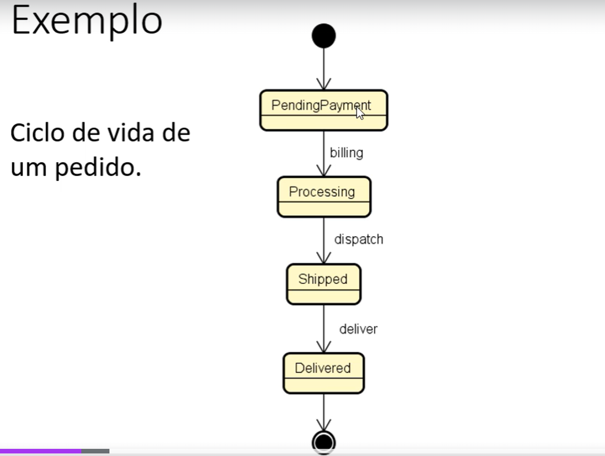
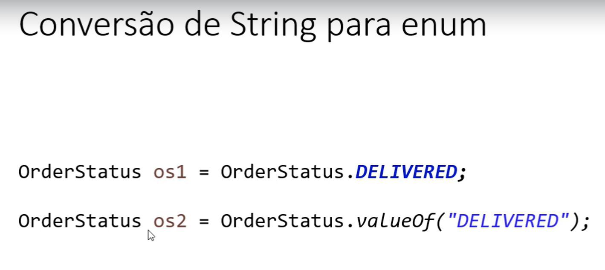
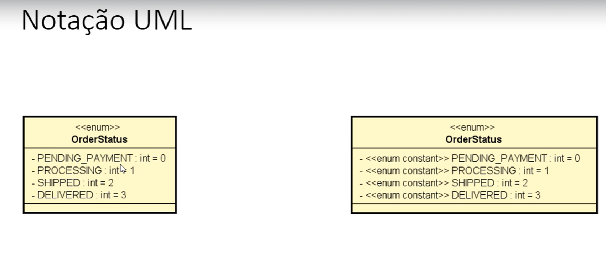

# Projeto Java: Enumerações e Composições.
Este é um projeto das aulas do curso: [**"
Java COMPLETO Programação Orientada a Objetos + Projetos"**](https://www.udemy.com/course/java-curso-completo/learn/lecture/33226456?start=90#content),
da Udemy. 
Com o professor _Nélio Alves._  

Enumerações:

- É um tipo especial que serve para
especificar de forma literal um conjunto de constantes relacionadas.

- Palavra chave em Java: enum.
  
-Vantagem: melhor semântica, código mais legível e auxiliado pelo compilador.

        Referências: https://docs.oracle.com/javase/tutorial/java/javaOO/enum.html

 Como construir String para enum:

Notação UML:

## 🛠️ Construído com

[**IntelliJ**]

## ✒️ Autores
**_Nayara Scherer._** 
[**Linkedin**](https://www.linkedin.com/in/nayara-scherer-5b894924a/)

